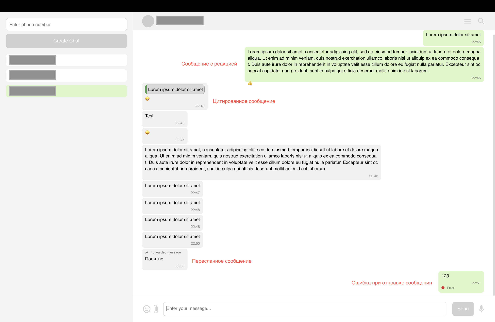

В рамках данного тестового задания были выполнены следующие задачи:

Реализован компонент для ввода учетных данных из системы GREEN-API, включающих idInstance и apiTokenInstance.

Разработан интерфейс для обмена текстовыми сообщениями в WhatsApp.

Реализована отрисовка различных типов текстовых сообщений: обычное сообщение, сообщение с цитатой, сообщение с реакцией и пересланное сообщение.

Реализовано создание чатов и возможность переключения между ними.

---

Для старта и сборки необходимы:

Node.js ,
yarn

Установка пакетов: yarn

Запуск приложения: yarn start